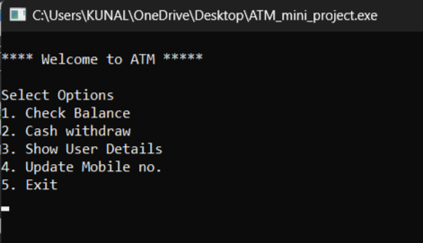
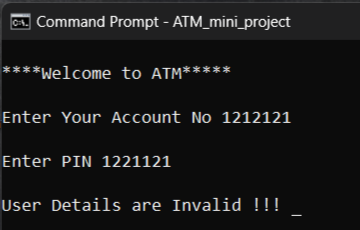

# -CPP-Mini-Projects
 

In this project, I implemented various functionalities of the ATM System by using c++ language
such as

    Check Balance
    CashWithdrawl
    User Details
    Update Details
    
 Here are some execution flow snaps
 
 <strong>Menu Driven Application</strong>

 
 
<strong> Validation </strong>

