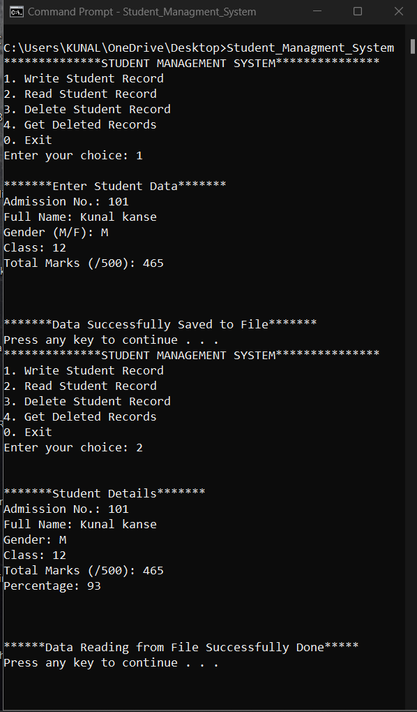
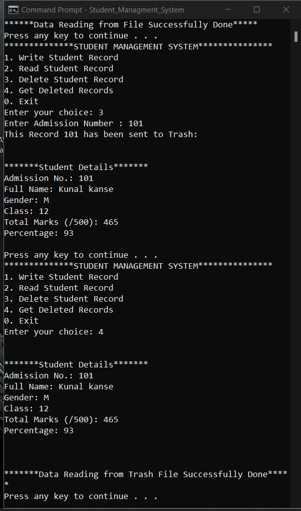

# CPP-Mini-Projects

By Using the functionalities Of Object Orientation & File Handliing in C++
developed CUI Based Application of Student management System 

it containg functionalities such as

1) Add new data (Registration)
2) Display Data
3) Delete Data
4) display Deleted Data 

used file handling for storing data,
like create file , write , read, open close

here is the Program execution flow
 

